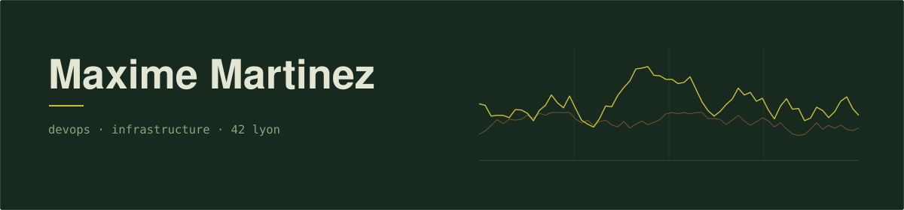
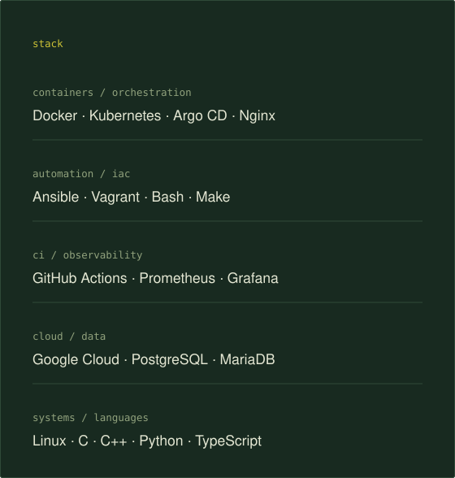
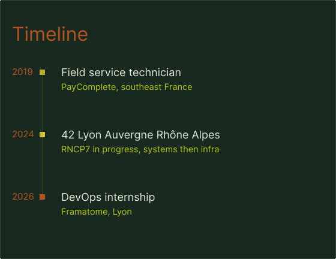

I spent five years repairing cash handling machines on customer sites before I
started at 42. Infrastructure turned out to be the same job with better tooling:
something is broken, people are waiting, go find out why.

Based in Lyon, open to DevOps and platform work.

### [ft_transcendence](https://github.com/Manomania/ft_transcendance)

Multiplayer arcade platform, five people, six months. I was the one who had to
make the whole thing actually run.

Thirteen services, four Docker networks, an Nginx reverse proxy in front, CI on
GitHub Actions, Prometheus and Grafana with a Blackbox Exporter for the probes,
one Postgres schema per service, secrets through Docker secrets. Most of my time
went into the network topology: the gateway has to reach everything, and nothing
else is allowed to.

### [Cloud-1](https://github.com/Manomania/Cloud-1)

Nginx, MariaDB, php8.2-fpm and phpMyAdmin, provisioned from nothing on a Debian
VM in Google Cloud by Ansible roles. Destroy the instance, run the playbook,
the site is back.

Getting there was less elegant than it sounds. WordPress stores its own URL in
the database, GCP hands out a new external IP on every rebuild, and the two facts
do not get along.

### [Inception of Things](https://github.com/Manomania/InceptionOfThings)

Two node K3s cluster on Vagrant, Ingress routing, and Argo CD reconciling the
cluster against a Git repository. Push to main, the cluster follows.

The three days I lost on this had nothing to do with Kubernetes: a stray K3s
instance still running on the host was stealing routes from the VMs underneath.

 

## Before this

Level 2 field maintenance technician at PayComplete, five years, banking
automation hardware across southeast France. On call, on site, a customer
watching, and a machine that had to work again before the branch opened.

Nobody there cared which framework was fashionable. That is roughly my position
on tooling now.

I still write low level code when something bothers me:
[ft_ping](https://github.com/Manomania/ft_ping) reimplements ping in C over raw
ICMP sockets, [ft_irc](https://github.com/Manomania/ft_irc) is an IRC server in
C++ following RFC 1459.

 

<b>42 cursus, full project list</b>

 

| Project | What it taught me |
|---|---|
| [minishell](https://github.com/Manomania/minishell) | Process control, forks, pipes, file descriptors |
| [philosophers](https://github.com/Manomania/philosopher) | Threads, mutexes, deadlock and starvation |
| [NetPractice](https://github.com/Manomania/NetPractice) | Subnetting, routing tables, network troubleshooting |
| [Inception](https://github.com/Manomania/inception) | First contact with Docker, one service per container |
| [Cub3D](https://github.com/Manomania/Cub3D) | Raycasting engine in C |
| [CPP 00 to 09](https://github.com/Manomania/CPP) | OOP, templates, STL, exceptions |
| [ft_irc](https://github.com/Manomania/ft_irc) | TCP server, RFC 1459, non blocking I/O |
| [ft_transcendence](https://github.com/Manomania/ft_transcendance) | Microservices, CI, monitoring, team lead |

Certified in C and in C++ on
[CodinGame](https://www.codingame.com/profile/85b780e0c973cc20cb7b3113734c81391256935).

## Get in touch

[LinkedIn](https://www.linkedin.com/in/maxime-martinez-643300254/) or
`maxime.martinez96@hotmail.fr`. Happy to talk about infrastructure, homelabs, or why
your Docker network cannot resolve that hostname.
